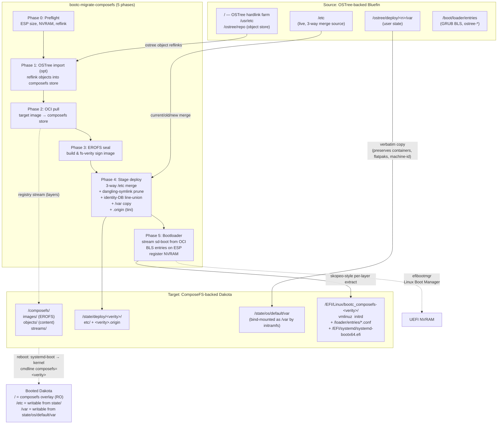

# bootc-migrate-composefs

In-place migration utility that converts an OSTree-backend bootc system
(e.g. Bluefin) into a ComposeFS-backend bootc system (e.g. Dakota), without
reinstalling and without losing `/home`, `/var`, `/etc` customizations,
flatpaks, container storage, or user accounts.

> **Status: experimental.** End-to-end on Bluefin → Dakota works through
> systemd-boot and a composefs root mount; the active workstream and current
> blockers are tracked in [HANDOFF.md](HANDOFF.md). Don't point this at a
> system you can't reinstall.

## Architecture



## What it does

Five phases, run as one command:

1. **Preflight** — free-space, reflink/CoW, UEFI, NVRAM-writable, ESP capacity.
2. **OSTree import** *(optional)* — reflinks existing OSTree file objects into
   the composefs object store so the pull in phase 2 is mostly dedup.
3. **OCI pull** — `bootc internals cfs oci pull` of the target bootc image.
4. **EROFS image** — builds and seals the composefs EROFS metadata image.
5. **Stage deploy** — 3-way `/etc` merge with identity-DB line-union,
   dangling `/usr/*` symlink pruning, `/var` data copy into
   `state/os/default/var` so user data appears under the bootc initramfs
   bind-mount, `.origin` (boot_digest, manifest_digest) written via tini.
6. **Bootloader** — installs systemd-boot on the ESP (extracted from the
   target image's OCI layers via direct registry streaming), writes BLS
   entries, registers `Linux Boot Manager` in UEFI NVRAM, keeps the existing
   OSTree GRUB entry as a fallback.

After a successful reboot into the composefs entry, `bootc-migrate-composefs
commit` removes the OSTree fallback and makes composefs permanent.

## Usage — end-to-end walkthrough

> **Before you start.** This tool rewrites bootloader state and copies the
> entire `/var`. Don't run it on a machine you can't reinstall in a pinch.
> Until you run `commit`, it's reversible — but a fresh backup is still
> cheap insurance.

### 1. Decide your target

The migration takes a `--target-image` — the composefs-backed bootc image
you want to end up on. Today the validated path is **Bluefin → Dakota**:

```
ghcr.io/projectbluefin/dakota:stable     # default target
```

If you're migrating a different OSTree-backed system (Aurora, Silverblue),
point `--target-image` at the composefs-flavored equivalent.

### 2. Check readiness with a dry-run

```bash
sudo bootc-migrate-composefs \
  --target-image ghcr.io/projectbluefin/dakota:stable \
  --dry-run
```

Things to confirm in the report:

- `Booted OSTree backend: Yes` — required; if `No` the tool refuses to run.
- `UEFI Boot Mode: Yes` + `NVRAM writable: Yes` — required for the
  systemd-boot path; on BIOS-only or locked NVRAM pass `--bootloader grub2`.
- `ESP Free Space: ≥ 150 MB` — we extract `systemd-bootx64.efi` from the
  target image onto the ESP.
- `Btrfs Filesystem: Yes` + `Reflink (CoW) Support: Yes` — xfs is tracked
  in [#16](https://github.com/hanthor/ostree-composefs-rebase/issues/16),
  not supported yet.
- `ComposeFS free space: ≥ 1.1 × ostree_repo_size` — the composefs object
  store is built by reflinking your existing OSTree objects.

### 3. Run the migration

```bash
sudo bootc-migrate-composefs \
  --target-image ghcr.io/projectbluefin/dakota:stable
```

Expect ~5–10 minutes on warm caches, ~15–25 minutes on a cold pull. Five
phase headers print as it goes:

| Phase | What's happening | Why it might take a while |
|---|---|---|
| **0 — Preflight** | Same checks as `--dry-run` | seconds |
| **1 — OSTree import** *(optional)* | Reflinks existing OSTree file objects into the composefs object store so Phase 2 mostly dedups | tens of seconds to a few minutes; skip with `--skip-import` |
| **2 — OCI pull** | `bootc internals cfs oci pull` of the target image | minutes (network-bound) |
| **3 — EROFS image** | Builds + fs-verity-signs the composefs metadata image | seconds |
| **4 — Stage deploy** | 3-way `/etc` merge, dangling-symlink prune, identity-DB line-union, OSTree-era `/etc` cruft drop, `/var` copy to `state/os/default/var`, `.origin` file written | ~1 minute |
| **5 — Bootloader** | Streams systemd-boot from target OCI layers (~1 GB peak), writes BLS entries, registers `Linux Boot Manager` in UEFI NVRAM | ~30s |

When it ends with `=== MIGRATION COMPLETED ===` the on-disk state is
ready. Reboot:

```bash
sudo systemctl reboot
```

### 4. Validate the composefs boot

Log in (your existing accounts and SSH keys still work) and check:

```bash
cat /proc/cmdline                                       # must contain composefs=<hex>
bootc status                                            # should report the composefs deployment
bootc status --json | jq .status.booted.composefs       # non-null
```

Spend a day on it. Run your usual workflow — flatpaks, dnf, containers,
homebrew, GNOME extensions, whatever. Everything that lived under `/home`,
`/var`, and `/etc` on Bluefin should be where you left it. If something
is missing or broken, you can roll back (see below).

### 5. Make it permanent (one-way)

Once you trust the new system:

```bash
sudo bootc-migrate-composefs commit
```

This removes the OSTree fallback entry from the ESP. Rollback after this
point is only via the still-present GRUB menu under `/boot/loader/entries/`.

### Flags

| Flag                  | Purpose                                                            |
| --------------------- | ------------------------------------------------------------------ |
| `--dry-run`           | Print every action; touch nothing                                  |
| `--skip-import`       | Skip phase 1 (faster when target image is mostly new content)      |
| `--bootloader grub2`  | Stay on GRUB2 instead of installing systemd-boot                   |
| `--skip-preflight`    | Bypass preflight checks (don't, unless you know exactly why)       |
| `--force`             | Proceed past non-fatal warnings                                    |

### Rollback / recovery

Until you run `commit`, the migration is **reversible**. The previous OSTree
deployment stays bootable:

- Phase 5 only *adds* the systemd-boot composefs entry; it never deletes the
  existing `/boot/loader/entries/ostree-*.conf` files.
- The original `/ostree/deploy/<n>/deploy/<commit>.0/` rootfs and
  `/ostree/deploy/<n>/var/` stay on disk.
- Phase 4 *copies* `/var` to `state/os/default/var`; the OSTree side's `/var`
  is independent of the composefs side's after migration.
- We push `Linux Boot Manager` (systemd-boot) to the front of NVRAM `BootOrder`
  but the `Fedora` shim entry remains listed.

To boot back into OSTree-Bluefin:

1. Power on; tap the firmware boot-menu key (commonly **F12**, **F8**, or **Esc**).
2. Pick the `Fedora` entry. GRUB will show the original `ostree:0` menu.
3. Boot it. You land on the pre-migration system with its `/var` and `/etc` intact.

Or, from a working composefs login, one-shot:

```bash
sudo efibootmgr -v | grep -E 'Fedora|Linux Boot Manager'
sudo efibootmgr --bootnext <Boot####-of-Fedora>
sudo systemctl reboot
```

After running `bootc-migrate-composefs commit`, the OSTree fallback is removed
from the ESP and rollback becomes one-way via the still-present GRUB entries
under `/boot/loader/entries/`. The E2E test exercises the full round-trip
(composefs → OSTree → composefs) on every run.

### What's preserved

Validated end-to-end (21 assertions per run; see `tests/run-e2e.sh`):

- **/var data** — `/var/lib/*`, `/var/log/*`, `/var/cache/*`, containers,
  flatpak system installs, machine-id, hidden dirs and symlinks
- **User homes** — `/var/home/<user>/`, dotfiles, project trees, SSH keys
  (with `.ssh` mode preserved so StrictModes still accepts your keys),
  wallpapers, GNOME extensions, dconf user db, glib gsettings keyfile,
  homebrew Cellar, per-user flatpak installs
- **/etc state** — `/etc/sudoers.d/*`, `/etc/hosts` edits, custom
  `sshd_config.d/*`, custom config files added under `/etc/`, in-place
  edits to image-shipped files (`/etc/hostname`), `/etc` symlinks
- **Accounts** — `/etc/passwd`, `/etc/shadow`, `/etc/group` line-union
  merged so users you added survive *and* users the target image needs
  (messagebus, polkitd, …) get added

What's intentionally *not* carried forward:

- OSTree/rpm-ostree state markers (`.updated`, `.rpm-ostree-shadow-mode-fixed2.stamp`)
- GRUB2 config files (`grub2.cfg`, `grub2-efi.cfg`, `/etc/grub.d/`) — the
  target uses systemd-boot
- Source-image `/etc` files the target image removed (e.g. `sshd_config.d/40-redhat-crypto-policies.conf`
  which references `/etc/crypto-policies/` paths Dakota doesn't ship)

### Troubleshooting

| Symptom | Likely cause | Fix |
|---|---|---|
| Phase 0 refuses with "System is not booted into an OSTree deployment" | You're already on composefs (or a non-bootc system) | Nothing to do |
| Phase 2 fails with ENOSPC mid-pull | `/sysroot/composefs` is tight on the 1.1× heuristic | Free space or grow the partition, then rerun |
| Post-reboot `cat /proc/cmdline` shows `ostree=` not `composefs=` | Firmware ignored the new NVRAM entry | Use firmware boot menu to pick `Linux Boot Manager`; if that fails, fall back to OSTree and report the firmware quirk |
| `bootc status` says "No manifest_digest in origin" | You're on an old build of this tool | Update — fixed in `aedd0c7` |
| SSH key auth broken post-migration | Hit the now-fixed `.ssh` 755 bug, or you set the dir permissive yourself | Update (fixed in `ebd5aeb`); or boot OSTree fallback and `chmod 700 ~/.ssh` |
| GNOME boots but session settings (wallpaper, accent) look wrong | Your dconf database needed compilation — bytes survived but GNOME hasn't re-read | `dconf update` as your user, or log out + back in |

## Requirements

- Booted on an OSTree-backed bootc system (Bluefin, Aurora, Silverblue…)
- UEFI firmware with writable NVRAM (for the systemd-boot path; GRUB2 fallback
  works on BIOS)
- Btrfs sysroot with reflink/CoW support (xfs tracked in
  [#16](https://github.com/hanthor/ostree-composefs-rebase/issues/16))
- ESP with ≥150 MB free
- ≥ `1.1 × ostree_repo_size` free on `/sysroot/composefs` (no reflink: 1.5×)

## Building

```
cargo build --release
```

Drops a single binary at `target/release/bootc-migrate-composefs`.

## End-to-end tests

A QEMU-based E2E harness lives in `tests/run-e2e.sh`. It installs Bluefin
into a disk image, runs the migration against a local registry mirror of the
Dakota target image, reboots, and validates the system came up on composefs.

```
sudo ./tests/run-e2e.sh
```

Overridable via env: `BASE_IMAGE`, `TARGET_IMAGE`, `DISK_SIZE`, `SKIP_SETUP`.

## Layout

- `src/main.rs` — CLI surface (clap)
- `src/preflight.rs` — environment validation
- `src/migration/mod.rs` — five-phase orchestrator
- `src/composefs.rs` — wraps `bootc internals cfs`
- `src/ostree.rs` — OSTree object scan + reflink import
- `src/mergetc.rs` — 3-way `/etc` merge
- `src/migration/bootloader.rs` — BLS entry generation
- `tests/run-e2e.sh` — QEMU E2E harness
- [SPECIFICATION.md](SPECIFICATION.md) — design doc
- [HANDOFF.md](HANDOFF.md) — current status, open issues, recent decisions

## License

TBD.
