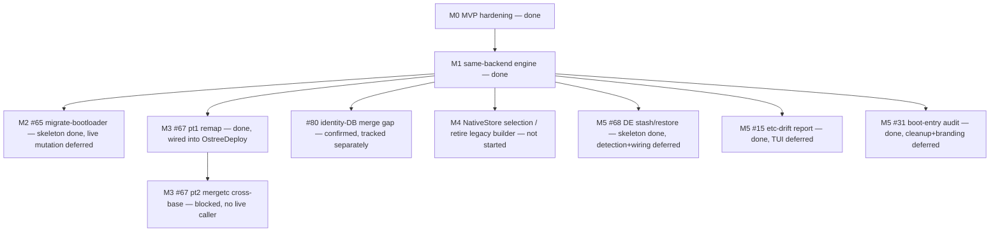

# Roadmap — from single-purpose migrator to universal bootc re-base engine

Status date: 2026-07-24. Living document; the issue tracker is authoritative
for day-to-day state, this file is authoritative for **shape and sequence**.

## Vision

One engine that moves a bootc system between **images, backends, bootloaders,
base families, and desktops** — safely, with a staged+rollback contract, and
with the same evidence-first discipline at every step: report before acting,
verify after acting, keep the previous state bootable.

Three deliverables share the code:

| Deliverable | What it is | Stability contract |
|---|---|---|
| `bootc-migrate` | The proven OSTree→ComposeFS migrator (**protected MVP**) | CLI surface, output, and behavior frozen; its four E2E cells are untouchable regression gates |
| `bootc-migrate-core` | The capability library: phases, preflight, /etc merge, transaction, registry streaming, stores, scan, remap, boot audit, DE stash/restore | Additive growth; everything new lands here first |
| `bootc-rebase` | The universal CLI: routing table × strategies | Where new user-facing capability ships |

## Where we are

**M0 (MVP hardening) and M1 (same-backend re-base engine) are done.** Every
issue under both milestones is closed. `bootc-rebase` truthfully routes all
four backend pairs (implemented for three of them; `composefs→ostree` remains
explicitly refused, not silently attempted) and the capability scan (#24)
covers every proposed probe.

**In progress, with an explicit boundary between what's landed and what's
deliberately deferred** — each of M2, M3, and M5 shipped a pure/unit-testable
"skeleton" slice, then stopped before the part that needs either boot-critical
live-system mutation or an interactive UI this codebase can't yet validate in
CI. See each milestone below for the specific line and why.

## Milestones

### M0 — MVP hardening (continuous; protects everything else) — **done**

All exit-criteria issues closed: #72 (cfs CLI drift, resolved short-term by
probe+delegation, long-term by #13's `NativeStore`), #22 (E2E rollback proof),
#26 (`rollback` subcommand), #25 (`commit` verified fresh-install-identical),
#17 (post-migration `/var` cleanup), #27 (sleep inhibitor), #18 (pre-baked SSH
E2E image), #12 (phase-module unit tests), #29 (Containerfile-initrd
alternative — evaluated and superseded by the shipped host-side dracut
`--rebuild` approach, closed as won't-implement).

**Exit criteria met**: rollback proven in CI; commit/undo produce
indistinguishable-from-fresh layouts; no known MVP flakes.

### M1 — Same-backend re-base engine (scenarios A / A′) — **done**

#63 (ostree-rebase E2E cell), #64 (`Strategy::OstreeDeploy`), #66
(`Strategy::ImageSwap`), #24 (capability scan: parsers, registry fetch wiring,
`bootc-rebase scan` subcommand, and the `Compatible: YES/NO` gate) — all
closed.

**Exit criteria met**: `bootc-rebase --plan` truthfully answers all four
backend-pair routes; ostree→ostree proven by its own E2E cell; scan output
drives route refusal with evidence.

### M2 — Bootloader migration (scenario B) — **skeleton landed, live mutation deferred**

[#65](https://github.com/tuna-os/bootc-migrate-composefs/issues/65) — the
pure core (BLS entry assembly, kernel-arg carry-over, entry-token derivation)
merged and is unit-tested; `bootc-rebase migrate-bootloader` exists as a CLI
shape but its `run` always refuses with "not implemented."

**Why stopped here**: the remaining work — ESP populate, NVRAM cutover via
`efibootmgr` with a `BootNext` one-boot trial before `BootOrder` promotion,
and the kernel-install resync hook (without which a flipped system silently
boots stale kernels after the next update) — is boot-critical and currently
unvalidatable: no E2E cell exercises it yet, and this isn't something a
compile+unit-test loop can prove correct. A full implementation plan (ESP
layout, NVRAM sequencing, resync-hook mechanism, phase-5 interplay, E2E cell
design) is posted on the issue for whoever picks it up with real
E2E-iteration budget and explicit sign-off on the risk.

**Exit criteria (not yet met)**: a GRUB2 bluefin VM re-bases, boots via
sd-boot, survives a kernel update, and `--undo` restores GRUB cleanly.

### M3 — Cross-base re-base (scenario C) — **part 1 done, part 2 blocked**

[#67](https://github.com/tuna-os/bootc-migrate-composefs/issues/67) part 1
(remap planner + apply walk over the staged deployment) is done and wired
into `OstreeDeploy`, gated by `is_cross_base` + `--accept-cross-base`.

Part 2 (a `mergetc`-style `/etc` merge conflict policy for cross-base
re-bases) is **blocked, not merely deferred**: `OstreeDeploy` and `ImageSwap`
both delegate `/etc` merging to `bootc switch`'s native OSTree merge, not to
`mergetc`, so there is no live caller for a `mergetc` cross-base extension
yet. Revisit once either route grows its own `/etc`-merge seam.

Related: [#80](https://github.com/tuna-os/bootc-migrate-composefs/issues/80)
confirmed (via reading ostree's `merge_configuration_from()` source directly)
that `bootc switch`'s native merge does plain whole-*file* 3-way merge with
**no** identity-DB (`passwd`/`group`/etc.) key-level reconciliation — the
exact class of problem `mergetc`'s union-merge exists to prevent. This is a
real gap in the `OstreeDeploy` route, tracked separately since fixing it
means either an upstream ostree/bootc change or new compensating logic, not a
`mergetc` cross-base extension.

**Exit criteria (not yet met)**: fedora-family → centos-family E2E cell with
a populated `/var`: correct ownership after reboot, report lists every
renumbered account, `.rebase-old` sidecars present where defaults were taken.

### M4 — Native store & the generation matrix (the #72 endgame) — **not started beyond the feature flag**

[#13](https://github.com/tuna-os/bootc-migrate-composefs/issues/13)'s
`NativeStore` (composefs/composefs-oci crates, no CLI shelling) exists behind
the `composefs-native` feature flag and is off by default. The default path
still probes host/target/builder for a legacy-CLI-capable bootc and pins
`quay.io/fedora/fedora-bootc:42` as a builder when none of the three has it —
visible in every E2E run's Phase 2 log line. Store **selection** by target
generation, and retiring the pinned legacy builder, have not been picked up.

**Exit criteria (not yet met)**: migration succeeds with *no* legacy-CLI
bootc anywhere (host, target, builder); `BMC_CFS_BUILDER` becomes a no-op
escape hatch.

### M5 — Desktop & UX (scenario E + human factors) — **computable cores landed, interactive/live pieces deferred**

Three issues, same shape: the pure/reusable core shipped; the interactive
TUI and (for #31) live NVRAM mutation did not, because neither is
exercisable by this project's build/clippy/test/fmt + E2E loop — a passing
CI run can't demonstrate a checklist UI works, and #31's remaining scope
(deleting/renaming boot entries) is the same unvalidatable-boot-mutation
class of risk as #65.

- [#68](https://github.com/tuna-os/bootc-migrate-composefs/issues/68) — DE
  config stash/restore (GNOME dconf/gnome-shell, KDE kdeglobals/plasma/…),
  a best-effort portable-preference extractor, and the
  `pre-switch.d`/`post-switch.d` hook contract are done, unit-tested, and
  exposed as `bootc-rebase de-migrate stash|restore`. Target-image DE
  *detection* (needs registry streaming, and realistically needs M3's
  cross-base hardening landed first since cross-DE is usually also
  cross-image) and wiring into the live `rebase` flow are not implemented.
- [#15](https://github.com/tuna-os/bootc-migrate-composefs/issues/15) — the
  factory-vs-live `/etc` diff computation is done, exposed as
  `bootc-migrate etc-drift` (table or JSON). The interactive
  checklist UI and its wiring into Phase 4's merge decision are not
  implemented.
- [#31](https://github.com/tuna-os/bootc-migrate-composefs/issues/31) — the
  UEFI boot-entry audit (dead/generic-label/duplicate/firmware-managed
  classification) is done, read-only, exposed as `bootc-rebase boot-entries`.
  Interactive selection, live entry removal, and branding-rename (which is a
  delete+recreate, so the same NVRAM-mutation risk) are not implemented.

**Exit criteria (not yet met)**: bluefin↔aurora-style switch preserves user
data untouched, stashes/restores DE state, swaps DE-scoped flatpaks on
request; non-experts can read what will happen before it happens.

### 1.0 — Universal migrator

All routes in the table implemented or explicitly refused with evidence;
MVP binary either retired into `bootc-rebase --target-backend composefs`
or kept as a thin alias; docs complete (architecture, generations,
recovery, hooks). Version and deprecation policy published.

## Dependency graph

## Risks & standing mitigations

- **Upstream drift is the norm, not the exception.** bootc replaced its cfs
  CLI once mid-project; assume it will again. Mitigation: the generation
  matrix (probe, delegate, native), pinned-builder escape hatch, and the
  empirical harness in docs/cfs-cli-generations.md to re-verify fast.
- **MVP regression via shared code.** Mitigation: MVP protection rule
  (frozen behavior, additive-only in core, probe-gated divergence), four
  untouchable E2E cells.
- **Boot-critical work can't be validated by this project's normal loop.**
  Mitigation, applied consistently across M2 and M5: land the pure/testable
  core, stop before live NVRAM/ESP/interactive-UI mutation, document the
  exact remaining plan on the issue, and require explicit sign-off + a
  dedicated E2E cell before attempting it — rather than shipping unvalidated
  boot-path code just because the rest of a PR's CI run was green.
- **CI capacity.** Runner starvation observed both 2026-07-19 (this repo's
  own concurrency groups) and 2026-07-24 (org-wide GitHub Actions queue
  congestion across most tuna-os repos simultaneously — not fixable from any
  one repo's side; just wait it out or check org Actions capacity/billing).
  Mitigation: everything is verified locally (or via a remote build host)
  before push; heavy validation designed as unit/loopback experiments where
  possible; E2E cells narrow and dispatchable individually.
- **Settings translation temptation (#68).** Prior art is unanimous that
  GNOME↔KDE translation fails; the spec forbids it. Stash/restore only.

## Decision log (summary — details in issues)

- Bootloader on ostree→ostree: migrate to systemd-boot **when ready** (#64)
- UID/GID divergence: **auto-remap with report** (#67)
- Cross-base /etc conflicts: **target defaults win**, user value kept as
  `.rebase-old` sidecar (#67, part 2 — not yet implemented, see M3 above)
- Store format is defined by the **reader at boot** (target image) — writer
  selection follows the target's generation (#13/#72)
- XBOOTLDR GUID-retype: **dead** (sd-boot ≥258.2 requires vfat) — ESP-copy
  + resync instead (#65)
- DE settings: **stash/restore, never translate** (#68)
- Boot-critical or UI-only remaining scope gets a documented plan on its
  issue, not a best-effort implementation without validation (#65, #31, #15)
